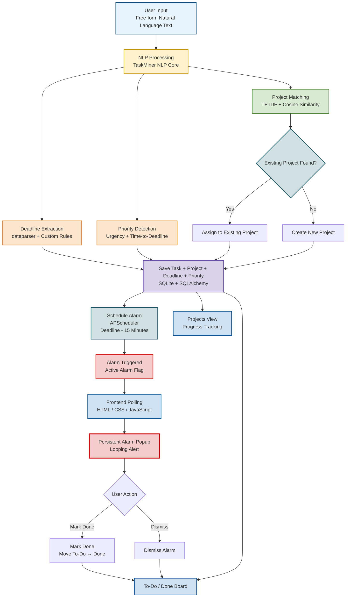

## 🧩 TaskMiner — NLP-Based Task, Project & Deadline Mining System

An NLP-powered task manager that reads plain, everyday text — not structured forms — and automatically extracts the task, identifies which project it belongs to, pulls out the deadline, and enforces it with a persistent alarm that only stops when you dismiss it.

🔗 Live Demo: https://bacterium-amazingly-rug.ngrok-free.dev/ 
🔗 GitHub: https://github.com/Komal467-ai/taskminer-nlp

### Overview

Daily task data usually arrives messy — a quick message, a forwarded schedule, a line buried in a job posting. Most task managers require you to manually create a task, tag a project, and set a reminder. TaskMiner instead:

- Reads free-form text and extracts the **task**, its **deadline**, and its **priority**
- Automatically figures out **which project** the task belongs to — even if related messages are typed on different days, worded differently
- Fires a **persistent pre-deadline alarm** (15 minutes before) that keeps alerting until manually dismissed, instead of a passive notification that's easy to ignore
- Tracks everything in a **To-Do / Done** board, plus a **Projects view** showing per-project progress

### Results

| Check | Outcome |
|---|---|
| Deadline extraction | Correctly resolves absolute ("15 August 6pm"), relative ("day after tomorrow"), and weekday-based ("next Monday 9am") expressions |
| False-positive filtering | Rejects non-date numeric fragments (currency, ranges like "1-2") that generic date parsers misread as dates |
| Project clustering | Groups reworded messages about the same project together via TF-IDF + cosine similarity, tested across multiple phrasings of the same topic |

_(Formal precision/recall benchmarking against a labelled message set is listed under Future Improvements.)_

### Project Structure

## 📁 Project Structure

```text
taskminer-nlp/
│
├── backend/
│   ├── main.py              # FastAPI application, API endpoints & alarm scheduling
│   ├── nlp_core.py          # Task, deadline, priority & project extraction
│   ├── db.py                # SQLite database & SQLAlchemy session setup
│   ├── models.py            # Project and Task database models
│   ├── test_nlp_core.py     # NLP core testing
│   └── requirements.txt     # Python dependencies
│
├── frontend/
│   └── index.html           # Task board, projects view & persistent alarm UI
│
├── README.md                # Project documentation
└── .gitignore               # Ignored files and folders
```

### 🔄 Component Responsibilities

| Component | Responsibility |
|---|---|
| `nlp_core.py` | Extracts task, deadline, priority and matches projects |
| `main.py` | FastAPI endpoints and APScheduler alarm logic |
| `models.py` | Defines Task and Project database models |
| `db.py` | Handles SQLite database connection through SQLAlchemy |
| `test_nlp_core.py` | Tests NLP extraction and project matching |
| `index.html` | Provides To-Do/Done board, Projects view and alarm popup |
| `requirements.txt` | Contains required Python packages |
### Architecture

### Tech Stack

| Layer | Technology | Why |
|---|---|---|
| Language | Python | Standard for NLP/backend work |
| API | FastAPI | Async, integrates directly with the Python NLP stack |
| Deadline parsing | dateparser + custom regex rules | Resolves absolute/relative dates; custom rules fix known mis-parses (see Limitations) |
| Project clustering | scikit-learn (TF-IDF + cosine similarity) | Matches new text against each project's accumulated corpus, fully offline |
| Database | SQLite via SQLAlchemy | Simple local persistence; swappable for PostgreSQL |
| Scheduling | APScheduler | Triggers the pre-deadline alarm in the background |
| Frontend | Vanilla HTML/CSS/JS | Fast, no build step, real-time board/alarm updates |

### How It Works

1. **Task Input** — user types a task in plain language
2. **NLP Processing**
   - Deadline extraction (dateparser + weekday/relative-date rules)
   - Priority heuristic (urgency keywords + time-to-deadline)
   - Project matching (TF-IDF similarity against existing projects; new project created if no match clears the threshold)
3. **Persistence** — task + project saved to SQLite
4. **Alarm Scheduling** — APScheduler computes (deadline − 15 min) and flips the task's alarm flag at that time
5. **Frontend Polling** — the UI polls for active alarms and shows a persistent, looping alert until the user dismisses it or marks the task done
6. **Board Update** — completed tasks move from To-Do to Done in real time

### Running Locally

git clone https://github.com/Komal467-ai/taskminer-nlp.git
cd taskminer-nlp/backend
pip install -r requirements.txt
uvicorn main:app --reload


Then open `frontend/index.html` directly in a browser (no build step needed).

### Limitations

- Project-clustering threshold is tuned on a small hand-written test set, not a large labelled dataset
- One deadline is extracted per message — messages describing multiple events (e.g. a multi-day schedule) only capture the last valid date found
- TF-IDF clustering is less robust than dense embeddings (Sentence-Transformers) for messages that are topically related but share few exact words
- No mobile push notifications yet — alarm is in-browser only, so the tab must stay open

### Future Improvements

- Swap TF-IDF clustering for Sentence-Transformer embeddings for stronger semantic matching
- Benchmark deadline/project extraction against a labelled test set (precision/recall, not just spot checks)
- WhatsApp/Telegram/email integration for automatic task ingestion
- Recurring task detection and automatic sub-task breakdown
- Native mobile app with OS-level push notifications for the alarm

### What This Project Demonstrates

- End-to-end system design: NLP pipeline → API → database → scheduled background jobs → real-time frontend
- Practical NLP: date/time extraction, text-similarity-based clustering, rule-based false-positive filtering
- REST API design with FastAPI
- Background job scheduling (APScheduler) for time-based enforcement, not just passive reminders
- Iterative debugging against real, messy, unstructured input (not just clean textbook examples)

### 📸 Application Demo

_Add screenshots here once the UI is finalized — same as the Home / Detection Result pattern used in TruthLens._

- 🏠 **Board View** — To-Do and Done columns, task cards with project/deadline/priority tags
- 📁 **Projects View** — tasks grouped by project with progress bar
- ⏰ **Alarm Popup** — persistent deadline alert with Mark Done / Dismiss actions
