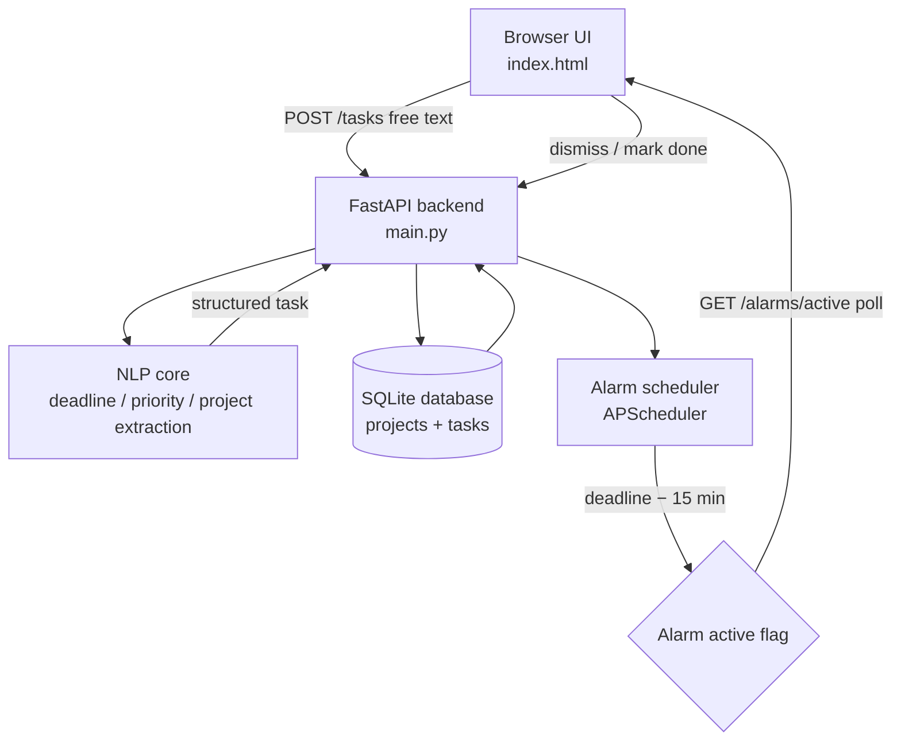

## 🧩 TaskMiner — NLP-Based Task, Project & Deadline Mining System

An NLP-powered task manager that reads plain, everyday text — not structured forms — and automatically extracts the task, identifies which project it belongs to, pulls out the deadline, and enforces it with a persistent alarm that only stops when you dismiss it.

🔗 Live Demo: _deploy in progress — see "Deployment" section below_
🔗 GitHub: https://github.com/Komal467-ai/taskminer-nlp

### Overview

Daily task data usually arrives messy — a quick message, a forwarded schedule, a line buried in a job posting. Most task managers require you to manually create a task, tag a project, and set a reminder. TaskMiner instead:

- Reads free-form text and extracts the **task**, its **deadline**, and its **priority**
- Automatically figures out **which project** the task belongs to — even if related messages are typed on different days, worded differently
- Fires a **persistent pre-deadline alarm** (15 minutes before) that keeps alerting until manually dismissed, instead of a passive notification that's easy to ignore
- Tracks everything in a **To-Do / Done** board, plus a **Projects view** showing per-project progress

### Results

| Check | Outcome |
|---|---|
| Deadline extraction | Correctly resolves absolute ("15 August 6pm"), relative ("day after tomorrow"), and weekday-based ("next Monday 9am") expressions |
| False-positive filtering | Rejects non-date numeric fragments (currency, ranges like "1-2") that generic date parsers misread as dates |
| Project clustering | Groups reworded messages about the same project together via TF-IDF + cosine similarity, tested across multiple phrasings of the same topic |

_(Formal precision/recall benchmarking against a labelled message set is listed under Future Improvements.)_

### Project Structure

taskminer/
├── backend/
│ ├── main.py # FastAPI app — endpoints + alarm scheduling
│ ├── nlp_core.py # task/project/deadline/priority extraction
│ ├── db.py # SQLAlchemy session/engine setup
│ ├── models.py # ORM models (Project, Task)
│ ├── test_nlp_core.py # standalone test of the NLP core
│ └── requirements.txt
└── frontend/
└── index.html # single-file UI — board, projects view, alarm

### Architecture

Client sends raw text → backend runs it through the NLP core → task + matched/new project persisted to the database → the scheduler watches deadlines in the background and flips a task's alarm flag 15 minutes before due → the frontend polls for active alarms and keeps alerting until the user dismisses it or marks the task done.

### Tech Stack

| Layer | Technology | Why |
|---|---|---|
| Language | Python | Standard for NLP/backend work |
| API | FastAPI | Async, integrates directly with the Python NLP stack |
| Deadline parsing | dateparser + custom regex rules | Resolves absolute/relative dates; custom rules fix known mis-parses (see Limitations) |
| Project clustering | scikit-learn (TF-IDF + cosine similarity) | Matches new text against each project's accumulated corpus, fully offline |
| Database | SQLite via SQLAlchemy | Simple local persistence; swappable for PostgreSQL |
| Scheduling | APScheduler | Triggers the pre-deadline alarm in the background |
| Frontend | Vanilla HTML/CSS/JS | Fast, no build step, real-time board/alarm updates |

### How It Works

1. **Task Input** — user types a task in plain language
2. **NLP Processing**
   - Deadline extraction (dateparser + weekday/relative-date rules)
   - Priority heuristic (urgency keywords + time-to-deadline)
   - Project matching (TF-IDF similarity against existing projects; new project created if no match clears the threshold)
3. **Persistence** — task + project saved to SQLite
4. **Alarm Scheduling** — APScheduler computes (deadline − 15 min) and flips the task's alarm flag at that time
5. **Frontend Polling** — the UI polls for active alarms and shows a persistent, looping alert until the user dismisses it or marks the task done
6. **Board Update** — completed tasks move from To-Do to Done in real time

### Running Locally
